# DATA DASHBOARD

## DESCRIPCIÓN GENERAL

### INTRODUCCIÓN

principal usuario: trainning manager.

 Un data dashboard es una representación gráfica que intervienen en la consecución de objetivos de una estrategia empresarial. Esta herramienta nos permite visualizar el problema y favorecer la toma de desiciones orientada a mejorar los posibles errores que podamos estar cometiendo.
 Teniendo claro el concepto de la funcionalidad de un Data Dashboard hemos detectado los problemas que presentan las Training Managers al momento de manipular data de Laboratoria ya que estos son extraídos de diferentes archivos(excel, goole doc,..) resultan demasiado pesados al momento de manipularlos además que no muestra información visual como gráficos que puedan ayudar en la mejor toma de desiciones para los procesos que realizan.
 Es por ello hemos decidido implementar un Data Dashboard con el objetivo

- OBJETIVO

El objetivo de este proyecto es permitirle al usuario acceder a la información de lecturas, quizzes y ejercicios de las estudiantes de forma global e individual de una manera más detallada y también a través de gráficos.

### INVESTIGACIÓN PARA EL DESARROLLO DEL PRODUCTO

1. PROCESO

  - ENTREVISTAS

   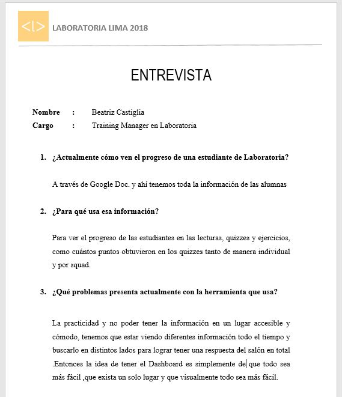
   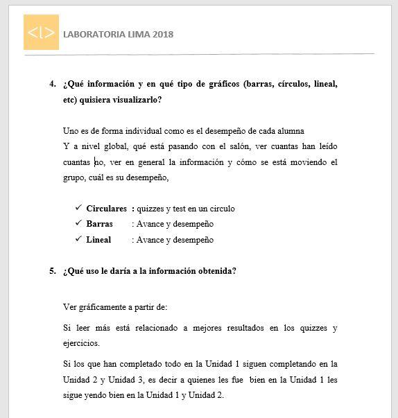
   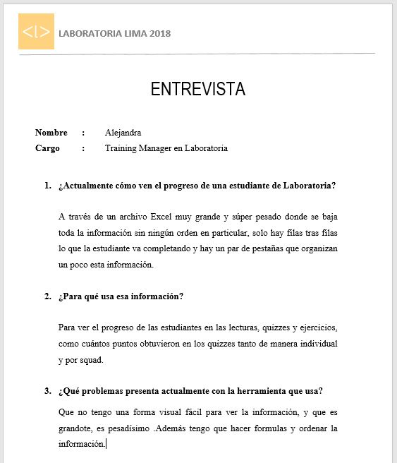
   
   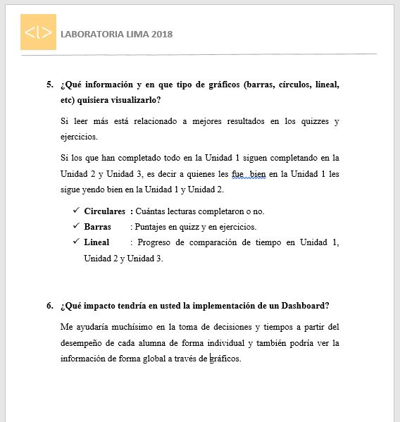

  - PROTOTIPO DE BAJA FIDELIDAD

   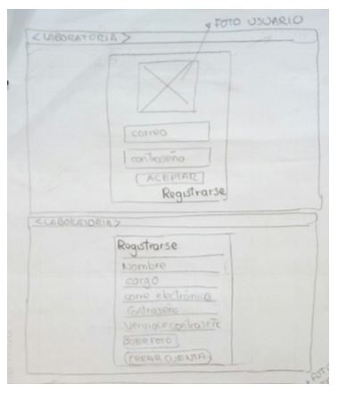
   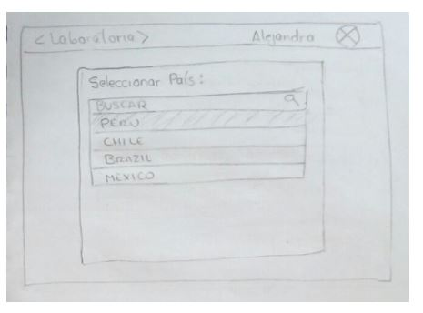
   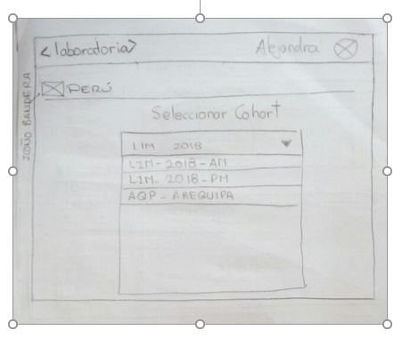
   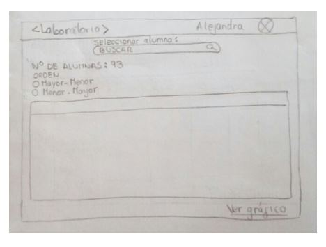
   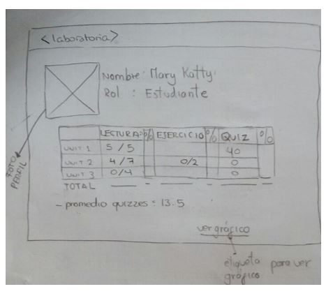
   
  - DIAGRAMA DE FLUJO

   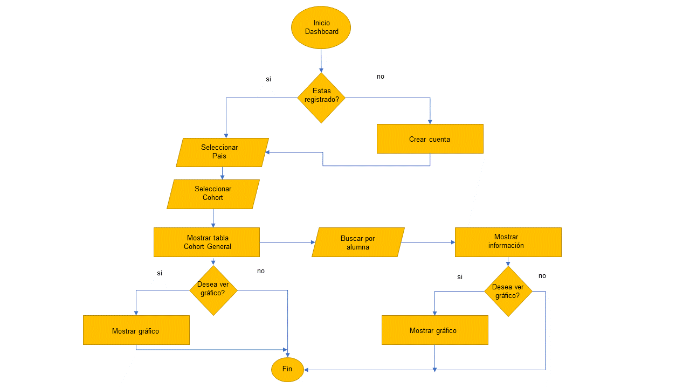

  - PROTOTIPO DE ALTA FIDELIDAD

   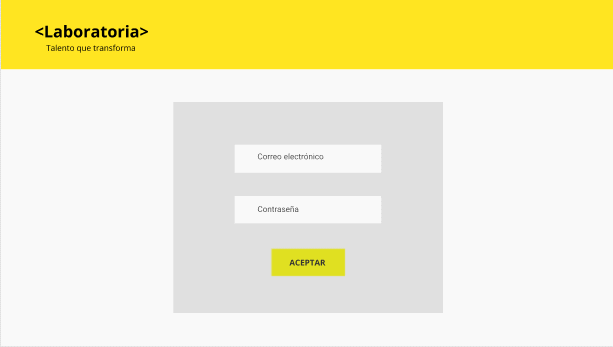

### DISEÑO WEB

1. ASPECTOS GENERALES
Las herramientas tecnológicas que serán utilizadas son:
- Javascript
- Node.js
- HTML
- CSS
- GITHUB, GITBASH.

